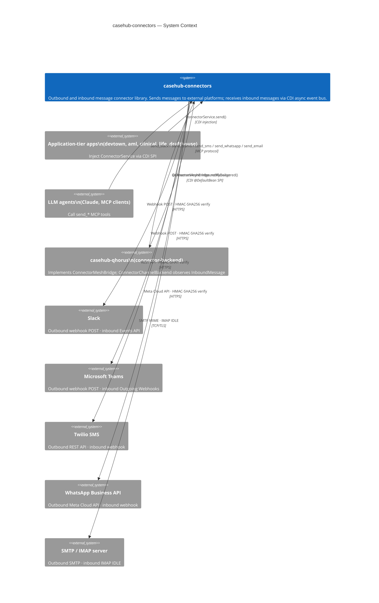
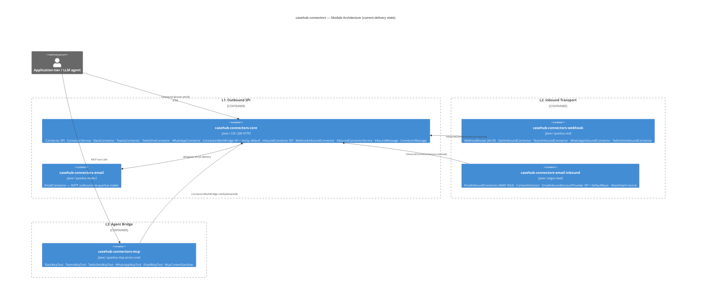
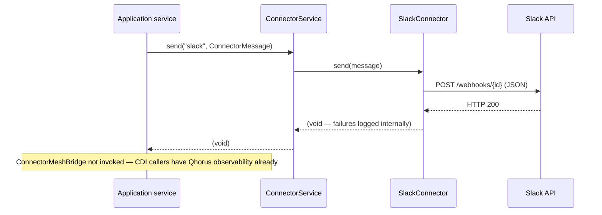
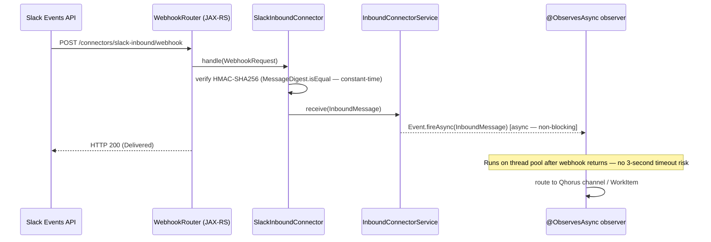
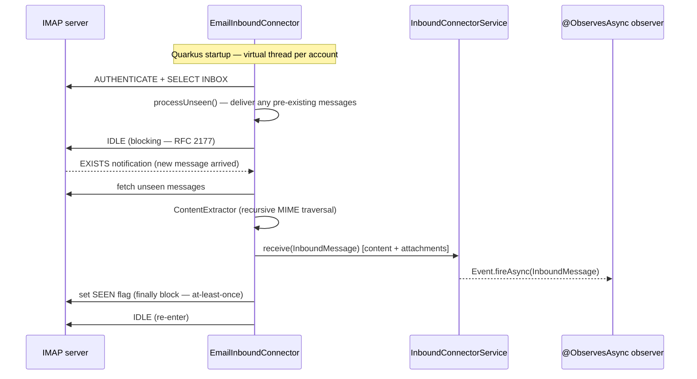
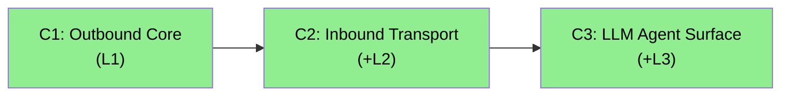
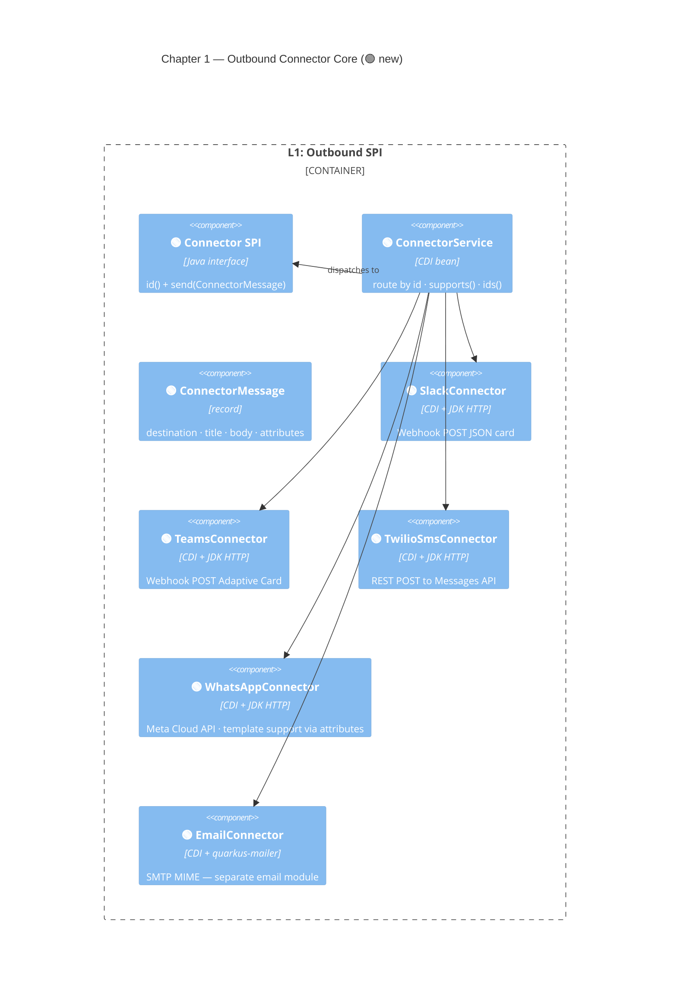
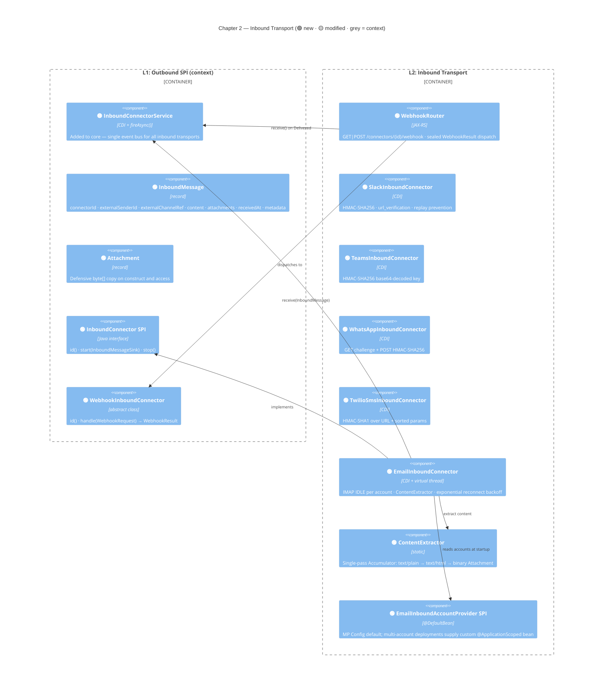
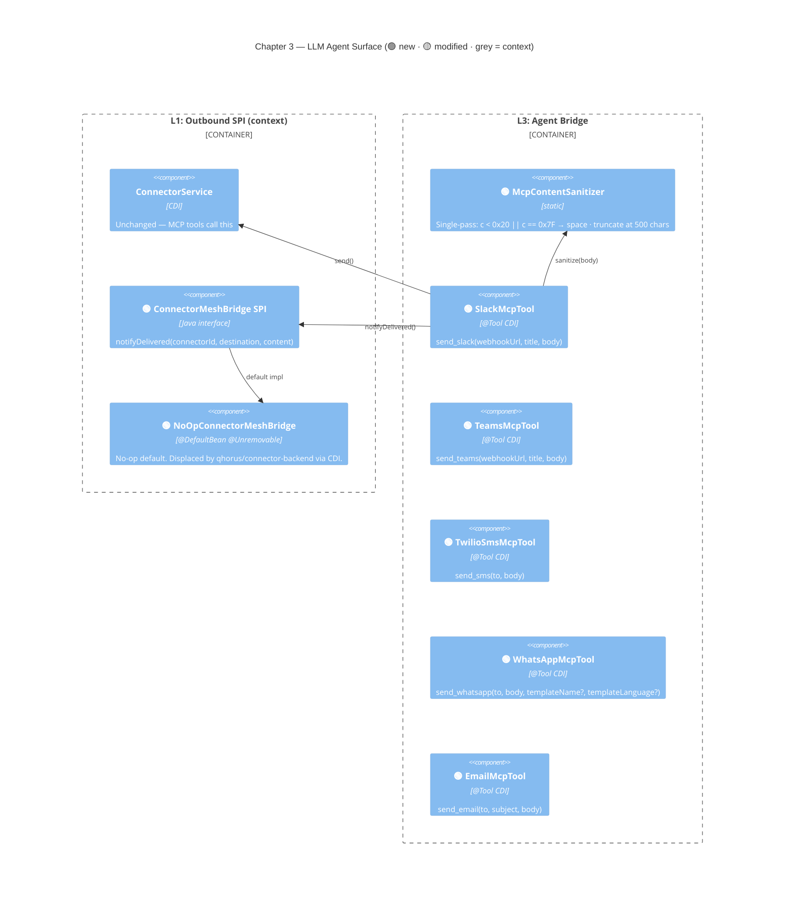

# casehub-connectors — ARC42STORIES.MD

**Spec:** Arc42Stories v0.1
**Profile:** CaseHub — Foundation tier
**Profile ref:** `../parent/docs/arc42stories-casehub-profile.md` · fallback: `https://raw.githubusercontent.com/casehubio/parent/main/docs/arc42stories-casehub-profile.md`
**Build position:** After casehub-platform; no other casehubio deps. Publishes before application-tier apps.
**Consumed by:** Application-tier harness apps (devtown, aml, clinical, life, drafthouse); casehub-qhorus (connector-backend bridge)
**Depends on:** None (`core`, `webhook`, `email-inbound` have zero casehubio deps). `mcp` adds `quarkus-mcp-server-core` only.

---

## §1 Introduction and Goals

### Description

`casehub-connectors` provides outbound and inbound message connectors — the delivery layer for notifications, escalations, and webhook integrations. It decouples application-tier domain logic from transport-specific implementation.

Core capabilities: outbound connectors (Slack, Teams, SMS, email, WhatsApp), inbound connectors (webhook receiver for four platforms, IMAP email inbound), connector SPI for application-tier extension, MCP tool surface for LLM agents, `ConnectorMeshBridge` SPI for Qhorus observability.

The connector layer handles mechanics of delivery; application-tier domain logic dispatches via the SPI without knowing the transport. A new transport (WhatsApp, Telegram) can be added without touching any application code.

### Artifact Schema

| Artifact type | Format | Example | Where it lives |
|---|---|---|---|
| Issue | `#NNN` or `casehubio/connectors#NNN` | `#12`, `casehubio/connectors#12` | GitHub Issues |
| Garden entry | `GE-YYYYMMDD-XXXXXX` | `GE-20260604-81a6a6` | `~/.hortora/garden/` |
| Protocol | `PP-YYYYMMDD-XXXXXX` | `PP-20260604-c0a86d` | `casehub-parent/docs/protocols/` |
| ADR | `ADR-NNNN` | `ADR-0003` | `docs/adr/` |
| Blog entry | `YYYY-MM-DD-[initials]NN-title` | `2026-06-04-mdp06-opening-connectors-to-llm-ecosystem` | workspace `blog/` |
| Design spec | `YYYY-MM-DD-topic-design` | `2026-05-29-connector-channel-backend-design` | `docs/specs/` |

Foundation-tier modules do not use an improvement log prefix — use issue refs directly.

### Stakeholders

| Stakeholder | Interest |
|---|---|
| Application-tier harness apps | Consume `ConnectorService` and inbound CDI events for case orchestration |
| Platform team | Maintain correctness, backward compatibility, and zero dep footprint in `core` |
| LLM sessions (Claude) | Navigate architecture and implement new transports or extend existing ones confidently |
| LLM agents (MCP clients) | Call `send_*` tools to deliver messages without CDI context |

### Quality Goals

| Priority | Goal | Scenario |
|---|---|---|
| 1 | Transport isolation | Application-tier domain logic never references transport-specific types — all delivery goes through the `Connector` SPI |
| 2 | Inbound decoupling | Webhook acknowledgements return immediately; observers run asynchronously — no 3-second platform timeout risk |
| 3 | Security by default | HMAC verification constant-time; content sanitized before bridge notifications; log injection prevented |
| 4 | LLM reachability | LLM agents without CDI context can send messages via MCP tools |
| 5 | Deployment opt-in | Adding outbound Slack does not pull SMTP, IMAP, or MCP dependencies |

---

## §2 Constraints

### Platform

Java 21 (on Java 26 JVM), Quarkus 3.32.2. Published to GitHub Packages as `io.casehub:casehub-connectors-*:0.2-SNAPSHOT`.

```bash
JAVA_HOME=$(/usr/libexec/java_home -v 26) mvn clean install
```

### Dependencies

Resolved from GitHub Packages: `https://maven.pkg.github.com/casehubio/*`. CI authentication via `GITHUB_TOKEN`.

**Zero casehubio foundation dependencies** in `core`, `webhook`, `email-inbound` — a deliberate policy. `core` can be embedded in any JVM application with no Quarkus dependency graph. Only `mcp` adds `quarkus-mcp-server-core` (not in the Quarkus BOM).

---

## §3 Context and Scope



### Boundary Rules

**casehub-connectors owns:** transport mechanics (sending and receiving), `Connector` SPI for custom outbound transports, `InboundConnector`/`WebhookInboundConnector` SPIs for custom inbound transports, `ConnectorMeshBridge` SPI interface and no-op default, `EmailInboundAccountProvider` SPI for multi-account deployments, `McpContentSanitizer`.

**casehub-connectors does not own:** Qhorus channel creation, case routing, audit records, SLA management, message business rules, or the `ConnectorMeshBridge` implementation (that lives in `qhorus/connector-backend`).

See `../parent/docs/PLATFORM.md` Capability Ownership table for the authoritative boundary map.

---

## §4 Solution Strategy

### Core Architectural Patterns

| Pattern | Expression in this library |
|---|---|
| CDI-native | Connectors are `@ApplicationScoped` CDI beans. No registry, no factory, no custom wiring. Custom connectors are auto-discovered. |
| Standard library HTTP | `java.net.http.HttpClient` only in `core`. Zero non-JDK HTTP dependencies — auditable, embeddable. |
| Direct REST | Each outbound connector implements its own REST call — self-contained and auditable; the full delivery path is visible in a single class |
| CDI async event bus | `Event.fireAsync(InboundMessage)` — connectors deliver and return immediately; observers run on a thread pool; Slack's 3-second retry deadline is never at risk |
| `@DefaultBean` displacement | SPI defaults (`ConnectorMeshBridge`, `EmailInboundAccountProvider`) are `@DefaultBean`; custom implementations displace without configuration |
| MCP bridge on success only | `ConnectorMeshBridge.notifyDelivered()` is called from MCP tools after successful `ConnectorService.send()` — CDI-only callers already have Qhorus observability |
| Content sanitization before bridge | Bridge receives content truncated to 500 chars with all ASCII control characters replaced — prevents ANSI injection in logs; original body goes to the connector unchanged |
| Tools never throw | MCP tools catch `Exception` broadly and return `"Failed: <message>"` — raw stack traces must not reach the LLM caller |

### Layer Taxonomy (Foundation tier — capability tiers)

Foundation modules define their own layer taxonomy. Layers here represent SPI tiers and transport implementations — not integration of casehubio foundation modules.

| Layer | Modules | Responsibility |
|---|---|---|
| L1: Outbound SPI | `core`, `email` | `Connector` SPI, `ConnectorService`, five outbound implementations, `ConnectorMessage` data model, `ConnectorMeshBridge` SPI + no-op default |
| L2: Inbound Transport | `webhook`, `email-inbound` | `InboundConnector` (pull) + `WebhookInboundConnector` (webhook) SPIs, `InboundConnectorService` async event bus, four webhook impls, IMAP IDLE with attachments, `EmailInboundAccountProvider` SPI, `InboundMessage` data model |
| L3: Agent Bridge | `mcp` | Five `@Tool` MCP beans, `McpContentSanitizer` |

### Chapter Sequencing Rationale

- C1 before C2: inbound SPIs and the CDI event bus pattern build on the module structure, CDI-native conventions, and `ConnectorMessage` established in C1
- C2 before C3: MCP tools call `ConnectorService` (L1); `ConnectorMeshBridge` bridges delivery notification — both require the full outbound pipeline to be useful
- Within C2: webhook SPI and email-inbound are independent and were built in the same session; email-inbound consumed the `InboundConnector` SPI defined alongside the webhook module in #4

---

## §5 Building Block View



### Module Dependency Rules

| Module | Depends on |
|---|---|
| `core` | No casehubio deps — JDK only + Quarkus CDI |
| `email` | `core` + `quarkus-mailer` |
| `webhook` | `core` + `quarkus-rest` |
| `email-inbound` | `core` + `angus-mail` |
| `mcp` | `core` + `email` + `quarkus-mcp-server-core` |

`email` and `email-inbound` are separate because `quarkus-mailer` (SMTP) and `angus-mail` (IMAP) share no infrastructure. `webhook` is separate because `quarkus-rest` is unnecessary for outbound-only deployments. `mcp` is separate because `quarkus-mcp-server-core` is not in the Quarkus BOM and adds no value to CDI-only deployments.

---

## §6 Runtime View

### Scenario 1 — Outbound delivery via CDI



### Scenario 2 — Inbound webhook receipt (Slack Events API)



### Scenario 3 — MCP tool call from LLM agent

```mermaid
sequenceDiagram
  participant LLM as LLM agent
  participant Tool as SlackMcpTool (@Tool)
  participant CS as ConnectorService
  participant Bridge as ConnectorMeshBridge
  participant Slack as Slack API

  LLM->>Tool: send_slack(webhookUrl, title, body)
  Tool->>CS: send("slack", ConnectorMessage)
  CS->>Slack: POST /webhooks/{id}
  Slack-->>CS: HTTP 200
  Tool->>Bridge: notifyDelivered("slack", webhookUrl, sanitize(body))
  Tool-->>LLM: "Dispatched to <webhookUrl>"
  Note over Tool: Returns "Dispatched to" — send() is void; delivery is best-effort
```

### Scenario 4 — IMAP IDLE email inbound



---

## §7 Deployment View

Published to GitHub Packages. CI: GitHub Actions. No GraalVM native target (foundation modules).

Consumers declare only the modules they need:

| Use case | Artifacts to add |
|---|---|
| Outbound-only (Slack, Teams, SMS, WhatsApp) | `casehub-connectors-core` |
| Outbound email | add `casehub-connectors-email` |
| Inbound webhooks (Slack, Teams, WhatsApp, Twilio) | add `casehub-connectors-webhook` |
| Inbound IMAP email | add `casehub-connectors-email-inbound` |
| MCP tool surface | add `casehub-connectors-mcp` + `quarkus-mcp-server-http` (transport) |

---

## §8 Crosscutting Concepts

### Protocol References

| Concern | Protocol / Reference |
|---|---|
| Module tier structure | `docs/protocols/universal/module-tier-structure.md` |
| CDI displacement (`@DefaultBean`) | `docs/protocols/casehub/alternative-extension-patterns.md` |
| SPI bridge placement (cross-repo) | `docs/protocols/casehub/bridge-module-spi-placement.md` |
| MCP tool exception catch-all | `PP-20260604-c0a86d` |
| X-Forwarded-For validation in log fields | `PP-20260529-ab32a9` |
| Inbound connector type separation | `PP-20260529-7b94ab` |
| Capability ownership | `../parent/docs/PLATFORM.md` Capability Ownership table |
| Architectural patterns | `../parent/docs/ARCHITECTURE.md` |

### Anti-patterns

**AP-1 — Blocking inside an `@ObservesAsync InboundMessage` observer**

| | |
|---|---|
| Symptom | Slack retries webhooks after 3 seconds; WhatsApp sends duplicate messages; Twilio logs callback failures. The connector HTTP response was 200 — the problem is downstream of it. |
| Cause | The async observer performs blocking I/O (database write, HTTP call) on the CDI dispatch thread pool without spawning a virtual thread. `Event.fireAsync()` uses a thread pool. A blocked observer holds a thread, degrading throughput for all inbound connectors. |
| Fix | Return from the observer immediately. Use `Thread.ofVirtual().start(...)` for any blocking downstream call. Do not annotate `@Transactional` unless the transaction completes within the platform's retry deadline. |

**AP-2 — Using `@Observes` instead of `@ObservesAsync` for `InboundMessage`**

| | |
|---|---|
| Symptom | No messages received by the observer despite successful webhook delivery (HTTP 200 returned to external platform). `InboundConnectorService.receive()` is called; the observer method never fires. No exception, no warning. |
| Cause | CDI 2.0 specifies that `@ObservesAsync` observers are only notified by `Event.fireAsync()`, not `Event.fire()`. A synchronous `@Observes` observer is silently skipped. |
| Fix | Annotate the observer: `void onMessage(@ObservesAsync InboundMessage msg)`. Test capture beans must also use `@ObservesAsync` with `BlockingQueue`-based capture. |

**AP-3 — Omitting `@Unremovable` on SPI defaults whose injection point is in another module**

| | |
|---|---|
| Symptom | `UnsatisfiedResolutionException` at Quarkus startup — a `@DefaultBean` SPI default in `core` is not found at runtime. The bean is present; the injection point is in `mcp`. |
| Cause | Quarkus ARC scans for injection points at augmentation time. When `core` is analysed without `mcp` on the augmentation path, ARC sees no consumer for the `@DefaultBean` and removes it. |
| Fix | Annotate the default: `@DefaultBean @Unremovable`. Do not add `@Unremovable` to non-default implementations — they have visible injection points. |

---

## §9 Journeys and Chapters

### §9.1 Journey Overview

**Journey 1: Bidirectional Connector Library** — deliver a complete outbound and inbound connector library that application-tier apps and LLM agents can use without transport-specific knowledge.



### §9.2 Chapter Index

| Chapter | Name | Status | Layers | Issues closed | Blog entries |
|---|---|---|---|---|---|
| C1 | Outbound Connector Core | ✅ Complete | L1 | #3, #5 (initial outbound setup) | mdp01 (context only) |
| C2 | Inbound Transport | ✅ Complete | +L2 | #4, #7, #8, #9, #10, #11, #12 | mdp01, mdp03, mdp05 |
| C3 | LLM Agent Surface | ✅ Complete | +L3 | #1 | mdp06 |

### §9.3 Chapters

---

#### Chapter 1 — Outbound Connector Core

**Status:** ✅ Complete  
**Issues:** #3 (module naming alignment), #5 (ConnectorService route-by-id)

**What this Chapter delivers:**

The foundational delivery capability. Application-tier code injects `ConnectorService` and routes by connector id — no transport-specific knowledge required. Five built-in implementations cover the common notification transports. `ConnectorMessage` is the single data model for all outbound delivery. Custom connectors implement `Connector` as `@ApplicationScoped` CDI beans and are auto-discovered.

**Modules introduced:** `casehub-connectors-core` (Slack, Teams, Twilio SMS, WhatsApp), `casehub-connectors-email` (SMTP via `quarkus-mailer`)

**Layer impact:**

| Module | Delta | Notes |
|---|---|---|
| `core` | 🟢 High (new) | `Connector` SPI, `ConnectorService`, four outbound connectors, `ConnectorMessage` record |
| `email` | 🟢 High (new) | Separate module — `quarkus-mailer` dep not forced on non-email deployments |



**Key decisions:**
- `java.net.http.HttpClient` only — zero non-JDK HTTP dep in `core`; auditable, embeddable anywhere
- Each connector owns its REST call — no shared HTTP wrapper hiding the delivery path
- `ConnectorMessage.attributes` (`Map<String,String>`) is the extension point for connector-specific extras; unrecognised keys silently ignored
- `send()` contract: must not throw unchecked exceptions; log failures and return; must be thread-safe
- `ConnectorService.send()` throws `IllegalArgumentException` on unknown id — failure message includes available ids for fast diagnosis

---

#### Chapter 2 — Inbound Transport

**Status:** ✅ Complete  
**Issues:** #4, #7, #8, #9, #10, #11, #12  
**Blog:** `2026-05-29-mdp01-email-arrives-imap-inbound`, `2026-05-31-mdp03-imap-idle-and-attachments`, `2026-06-02-mdp05-fixing-idle-timing-properly`  
**ADRs:** ADR-0001, ADR-0002  
**Design spec:** `2026-05-29-connector-channel-backend-design`

**What this Chapter delivers:**

Full bidirectional message transport. External platforms push messages in via HTTP webhooks or SMTP; the library fires a CDI async event; observers react on a thread pool. Two distinct inbound SPIs handle the two transport models — lifecycle semantics differ (pull vs webhook), so the type system expresses the distinction rather than using no-op interface methods. `InboundMessage` is the single data model for all inbound delivery, carrying content, attachments, and connector-specific metadata.

**Modules introduced:** `casehub-connectors-webhook`, `casehub-connectors-email-inbound`  
**Modules modified:** `casehub-connectors-core` (added `InboundConnector` SPI, `WebhookInboundConnector`, `InboundConnectorService`, `InboundMessage`, `Attachment`, switched to `fireAsync()`)

**Layer impact:**

| Module | Delta | Notes |
|---|---|---|
| `core` | 🟡 Medium (extended) | Inbound SPIs, `InboundConnectorService`, `InboundMessage`, `Attachment`, `fireAsync()` |
| `webhook` | 🟢 High (new) | `WebhookRouter` + 4 webhook implementations; `quarkus-rest` dep separate from `core` |
| `email-inbound` | 🟢 High (new) | IMAP IDLE, `ContentExtractor`, `EmailInboundAccountProvider` SPI; `angus-mail` dep separate |



**Key decisions (ADR-0001 / ADR-0002):**
- Two inbound types, not one: `InboundConnector` for pull, `WebhookInboundConnector` for webhook — lifecycle semantics are genuinely different; a unified SPI with no-op `start()`/`stop()` makes the contract misleading (ADR-0001)
- IMAP IDLE only — no polling fallback; RFC 2177 universal in target deployments; one code path; loud failure on unsupported server (ADR-0002)
- `Unauthorized` POST → HTTP 200 (suppress retry storms); `Unauthorized` GET → HTTP 403 (admin console failure must be visible)
- `ContentExtractor` single-pass `Accumulator` — prefers `text/plain` over `text/html`; uses `Part.getContent()` dispatch before `getInputStream()` for binary parts (Jakarta Activation DCH not registered for binary types in plain angus-mail environments)
- SEEN flag set in `finally` block — at-least-once delivery; observers must be idempotent
- All HMAC comparisons use `MessageDigest.isEqual()` — constant-time; immune to timing attacks
- `InboundMessage.connectorId` is always the connector type string (e.g. `"email-inbound"`) — never an account-level id; per-account identity goes in `metadata["account-id"]`
- `externalSenderId` identifies the conversation partner; `externalChannelRef` identifies our endpoint — callers that need per-conversation channel granularity key on `externalSenderId`

**Test count at C2 completion:** 126 tests, deterministic across cold Maven builds

---

#### Chapter 3 — LLM Agent Surface

**Status:** ✅ Complete  
**Issues:** #1  
**Blog:** `2026-06-04-mdp06-opening-connectors-to-llm-ecosystem`  
**ADR:** ADR-0003

**What this Chapter delivers:**

Opens the connector library to LLM agents via five MCP tools. Agents that cannot inject CDI beans (Claude, any MCP client) can deliver Slack, Teams, SMS, WhatsApp, and email messages with a single tool call. `ConnectorMeshBridge` SPI in `core` provides the hook for Qhorus observability — when `qhorus/connector-backend` lands on the classpath, it displaces the no-op default and posts an `EVENT` to the active Qhorus observe channel for every delivery.

**Modules introduced:** `casehub-connectors-mcp`  
**Modules modified:** `casehub-connectors-core` (added `ConnectorMeshBridge` SPI, `NoOpConnectorMeshBridge @DefaultBean @Unremovable`; WhatsApp template support in `ConnectorMessage.attributes`)

**Layer impact:**

| Module | Delta | Notes |
|---|---|---|
| `core` | 🟡 Low (extended) | `ConnectorMeshBridge` SPI + no-op default; WhatsApp `templateName`/`templateLanguage` in `attributes` |
| `mcp` | 🟢 High (new) | Five `@Tool` beans, `McpContentSanitizer`, `quarkus-mcp-server-core` dep |



**Key decisions (ADR-0003):**
- `ConnectorMeshBridge` in `core`, not `mcp` — `qhorus/connector-backend` already depends on `core`; placing the SPI in `mcp` forces `quarkus-mcp-server-core` onto a module with nothing to do with MCP (ADR-0003)
- `@Unremovable` on `NoOpConnectorMeshBridge` — injection point lives in `mcp`; ARC sees no consumer when `core` is analysed at augmentation time and would silently eliminate the bean
- Tools return `"Dispatched to"` not `"Delivered to"` — `ConnectorService.send()` is void; connectors log failures internally; `"Delivered"` is a false premise LLMs would act on
- `McpContentSanitizer` guards bridge notifications — handles all ASCII control characters including ESC (`\x1B`); original body passed to `ConnectorService` unchanged
- WhatsApp `templateName`/`templateLanguage` via `ConnectorMessage.attributes` — backward-compatible; callers that need template support pass attributes; callers that don't ignore them

### §9.4 Layer × Chapter Matrix

| Layer | C1 | C2 | C3 |
|---|---|---|---|
| L1: Outbound SPI (`core`, `email`) | 🟢 new | 🟡 extended — inbound SPIs + `InboundConnectorService` + `fireAsync()` | 🟡 extended — `ConnectorMeshBridge` SPI + WhatsApp templates |
| L2: Inbound Transport (`webhook`, `email-inbound`) | — | 🟢 new | — |
| L3: Agent Bridge (`mcp`) | — | — | 🟢 new |

---

## §10 Architectural Decisions

Three decisions captured in ADRs. Only decisions not derivable from reading the code inline.

| ADR | Decision | Key tradeoff |
|---|---|---|
| ADR-0001 | Separate `InboundConnector` (pull) and `WebhookInboundConnector` (webhook) types — not a unified SPI | Two types vs one: two types cost a new contributor one conceptual distinction; a unified type costs misleading no-op lifecycle methods on every webhook connector |
| ADR-0002 | IMAP IDLE only — no polling fallback | Single code path + loud failure vs graceful degradation to polling for servers that don't support RFC 2177 (none exist in target deployments) |
| ADR-0003 | `ConnectorMeshBridge` SPI in `core`, not in `mcp` | `@Unremovable` annotation required on no-op default (ARC would otherwise eliminate it) vs forcing `quarkus-mcp-server-core` dependency onto `qhorus/connector-backend` for a pure CDI bean |

See `docs/adr/` for full decision records with options considered and consequences.

**Implementation decisions — connectors#2 (2026-06-07):**

- **`casehub-connectors-slack-bot` as a separate submodule, not in `core/`.** `core` is a dependency of every downstream repo; adding a bot-specific HTTP client there pollutes all consumers with a capability most never use. `email-inbound` is the precedent for this split.
- **Shared `HttpHelper.CLIENT` for bot HTTP calls.** Creating a second `HttpClient` instance produces two independent connection pools with divergent timeout configuration. All outbound HTTP in `casehub-connectors-*` goes through the shared singleton.
- **`Json.createObjectBuilder()` for JSON payload construction.** Manual `StringBuilder` building is fragile under charset edge cases and diverges from the pattern used across the rest of the codebase. The Jakarta JSON API is already on the classpath.

**Implementation decisions — connectors#18 (2026-06-10):**

- **`MAX_PAGES = 50` as a bounded pagination policy.** `SlackBotClient.listChannels()` now follows cursor pagination rather than returning only the first 200 channels. The cap bounds memory use and protects against cursor-cycle bugs in the Slack API; when hit, a WARNING is logged and the accumulated channels are returned.
- **Fail-soft partial-result contract for paginating HTTP methods.** On any mid-loop failure (API error, interrupt, cap hit), the accumulated results are returned with a WARNING rather than empty list — a caller cannot distinguish an empty workspace from a failed third page.
- **HTTP 429 retry during pagination is explicitly deferred.** Rate-limiting surfaces as `ok:false / error:ratelimited` through the existing WARNING path. Full Retry-After handling is a known gap; `listChannels()` is called on-demand rather than in a hot path.

---

## §11 Quality Requirements

| Priority | Goal | Scenario | Status |
|---|---|---|---|
| 1 | Transport isolation | Application-tier code calls `ConnectorService.send("slack", msg)` with no Slack SDK dependency | ✅ All delivery through `Connector` SPI |
| 2 | Inbound non-blocking | Slack webhook receives HTTP 200 before any domain observer runs | ✅ `Event.fireAsync()` returns before observers execute |
| 3 | Security by default | HMAC forgery, replay attacks, and ANSI log injection all defeated at connector boundary | ✅ Constant-time HMAC, replay prevention, `McpContentSanitizer` |
| 4 | LLM reachability | Claude sends a Slack message with no CDI context | ✅ Five MCP tools in `mcp` module |
| 5 | Deployment opt-in | Outbound-only deployment has no `quarkus-rest`, `angus-mail`, or `quarkus-mcp-server-core` | ✅ Five separate Maven artifacts |
| 6 | Test determinism | Email-inbound tests pass reliably on cold Maven builds | ✅ IDLE race eliminated via `deliverDirect()` + Awaitility (#12) |

---

## §12 Risks and Technical Debt

| Item | Type | Severity | Notes |
|---|---|---|---|
| `ConnectorMeshBridge` is a no-op until qhorus#249 lands | Pending integration | Medium | MCP tool deliveries are unobserved in Qhorus channels. No functional breakage — observability is best-effort. Will self-resolve when `qhorus/connector-backend` ships. |
| Email inbound at-least-once — SEEN flag race on JVM kill | Delivery guarantee | Low | SEEN flag written in `finally`; a JVM kill mid-flag causes redelivery on next start. Documented. Observers must be idempotent. Acceptable for a foundation library. |
| Pre-provisioned channels only in qhorus bridge v1 | Feature gap | Low | `ConnectorChannelBackend` in qhorus discards inbound messages with no pre-provisioned channel. Auto-creation on first contact requires ACL and rate-limit governance decisions. |

---

## §13 Glossary

| Term | Definition |
|---|---|
| `Connector` SPI | Domain-agnostic dispatch interface — `id()` + `send(ConnectorMessage)`. Application tier calls the SPI; the connector handles transport specifics. |
| `ConnectorService` | CDI bean routing `send()` by connector id. Entry point for all outbound delivery. Throws `IllegalArgumentException` on unknown id (message includes available ids). |
| `ConnectorMessage` | Immutable record: `destination`, `title`, `body`, `attributes`. Single data model for all outbound delivery. `attributes` carries connector-specific extras. |
| `ConnectorMeshBridge` SPI | Post-delivery hook called by MCP tools after successful `send()`. No-op `@DefaultBean @Unremovable` default; displaced by `qhorus/connector-backend` to post an `EVENT` on the active Qhorus observe channel. |
| `InboundConnector` SPI | Pull-based inbound transport. `id()` + `start(InboundMessageSink)` + `stop()`. Lifecycle managed by `InboundConnectorService` at Quarkus startup/shutdown. |
| `WebhookInboundConnector` | Push-based inbound transport. `id()` + `handle(WebhookRequest) → WebhookResult`. No lifecycle — the JAX-RS endpoint IS the lifecycle. Not a subtype of `InboundConnector`. |
| `InboundConnectorService` | CDI singleton. Starts all `InboundConnector` instances at startup; provides `receive(InboundMessage)` which calls `Event.fireAsync()` — the single event bus for all inbound transports. |
| `InboundMessage` | Immutable record: `connectorId`, `externalSenderId`, `externalChannelRef`, `content`, `attachments`, `receivedAt`, `metadata`. `connectorId` is always the connector type string (not account-level). |
| `Attachment` | Immutable binary attachment record. Defensive `byte[]` copy on both construction and access — records do not enforce array immutability. |
| `WebhookResult` | Sealed type: `Delivered`, `Challenged`, `Ignored`, `Unauthorized`. `WebhookRouter` exhaustively pattern-matches — missing a case is a compile error. |
| `EmailInboundAccountProvider` SPI | Provides `List<EmailInboundAccount>` for `EmailInboundConnector`. `@DefaultBean` reads from MP Config. Custom `@ApplicationScoped` bean without `@DefaultBean` supplies multi-account or DB-backed configs. |
| `McpContentSanitizer` | Single-pass `StringBuilder` loop: replaces all ASCII control characters (`c < 0x20 || c == 0x7F`, including ESC `\x1B`) with space; truncates at 500 chars. Prevents ANSI injection in bridge log output. |
| `@DefaultBean` displacement | Quarkus CDI pattern: a `@DefaultBean` is displaced by any `@ApplicationScoped` implementation without `@DefaultBean`. Used for all SPI defaults in this library. |
| `@Unremovable` | Quarkus ARC annotation preventing augmentation-time bean removal. Required on `@DefaultBean` instances whose injection point lives in a different module — ARC sees no consumer in the declaring module and would otherwise silently eliminate the bean. |
| IMAP IDLE | RFC 2177 server-push notification. IMAP server notifies the client immediately on new message arrival — sub-second latency vs up-to-60s polling. `EmailInboundConnector` uses one virtual thread per account. |
| At-least-once delivery | Delivery guarantee where a message may be delivered more than once on JVM crash (SEEN flag race). Observers must be idempotent. Used by `EmailInboundConnector`. |
| `externalSenderId` | Who sent the message — Slack user ID, E.164 phone number, email address. The conversation partner. |
| `externalChannelRef` | Where the message arrived at our system — our Twilio number, our IMAP inbox, our Meta phone number ID. NOT the conversation partner for SMS/WhatsApp/email. |

---

*Migration complete 2026-06-04. Sources: DESIGN.md, docs/adr/ (ADR-0001–ADR-0003), workspace blog/ (mdp01–mdp06), design/JOURNAL.md, GitHub issues #1–#14, parent/docs/arc42stories-casehub-profile.md.*
